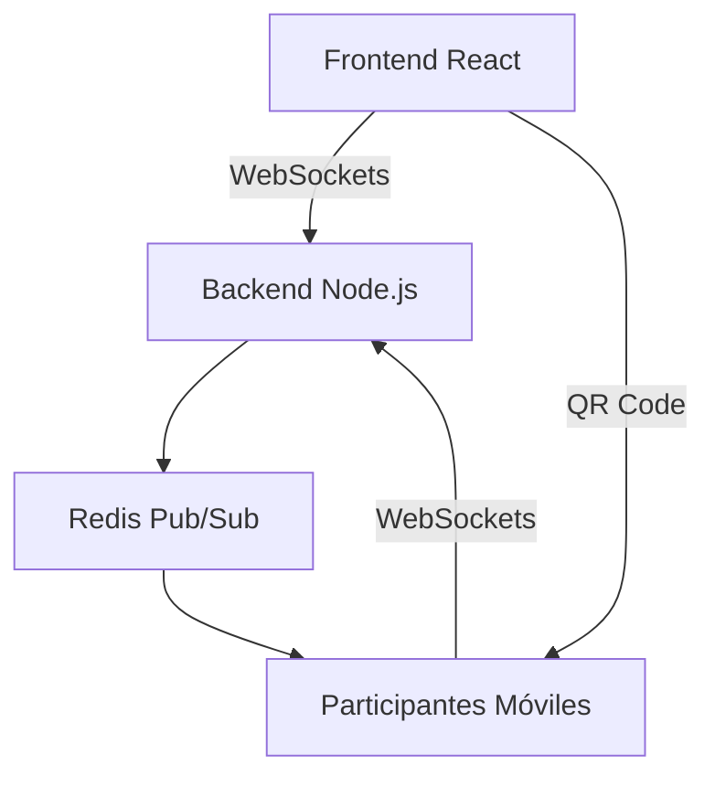
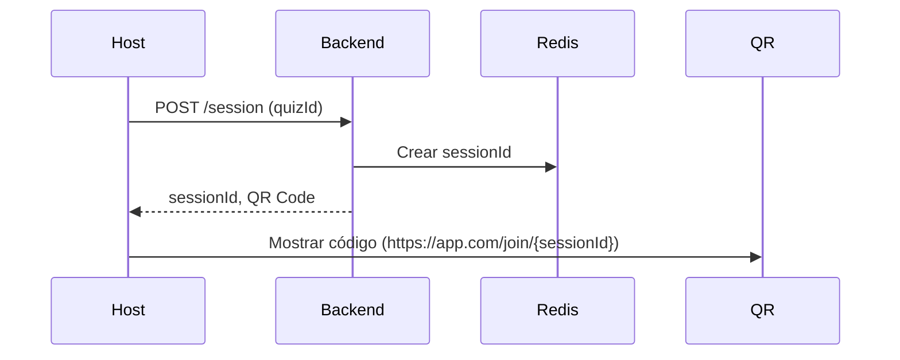
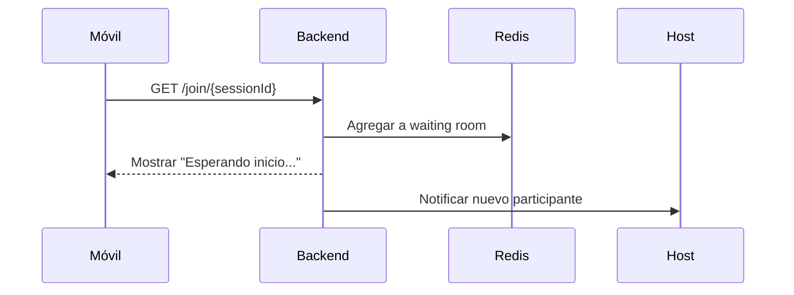

# Aplicación de quiz en Tiempo Real con React y Node.js

## Estructura general



### Componentes Clave a Implementar

#### 1. Backend (Nuevo servicio)

**Tecnologías:** Node.js + Express + Socket.IO + Redis

**Funcionalidades:**

- Manejar salas de quiz
- Comunicación en tiempo real
- Sincronización de estado
- Temporizadores

**Endpoints:**

- `POST /session` → Crear nueva sesión
- `GET /session/:id` → Obtener estado de sesión

#### 2. Redis Structure

```
// Sala de espera
"sessions:waiting:{sessionId}": Set de participantes

// Estado del quiz
"sessions:active:{sessionId}": {
  "currentQuestion": 0,
  "timeRemaining": 30,
  "status": "playing" // waiting, playing, finished
}

// Respuestas
"answers:{sessionId}:{questionIndex}": Hash {
  "participantId1": "optionA",
  "participantId2": "optionB"
}
```

#### 3. Flujo principal (Host desktop)



#### 4. Flujo de Participante (Dispositivo Móvil)


